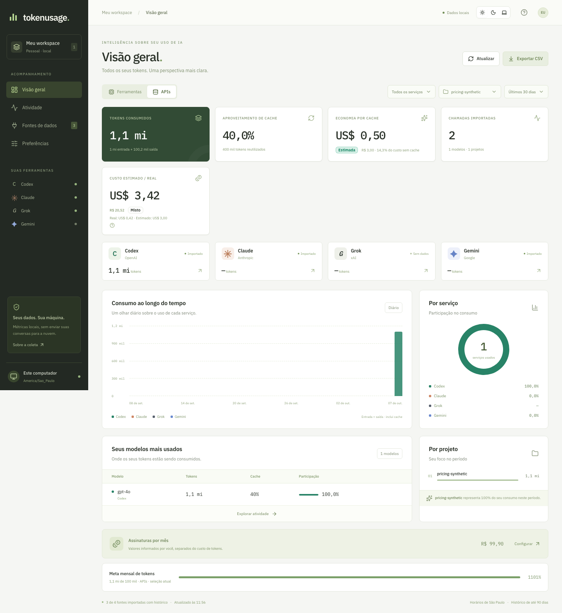
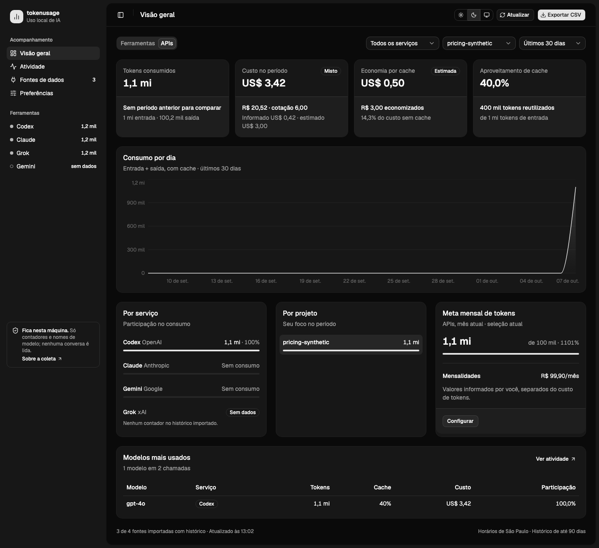
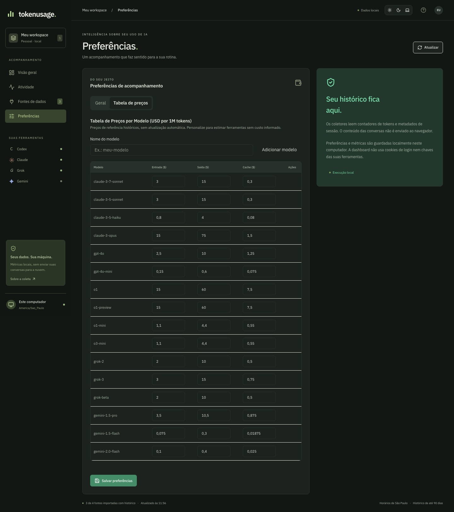
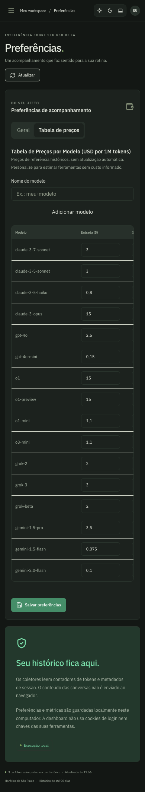

# Tokenusage

Dashboard pessoal em português para acompanhar tokens de **Codex, Claude Code,
Grok Build e Gemini CLI** usando o histórico do perfil local. Também permite
importar logs de chamadas de API dos seus projetos, sem chaves administrativas.

## Executar

Requer Node.js 24 ou superior.

```sh
npm ci
npm run dev
```

Abra **http://127.0.0.1:3000**. A primeira coleta lê o histórico; as seguintes
reutilizam o cache dos arquivos inalterados. A página atualiza a cada minuto
quando a aba está visível. Os scripts ligam o servidor apenas em `127.0.0.1`.

Para executar a versão otimizada:

```sh
npm run build
npm start
```

## Instalar pelo Homebrew

Esta fórmula instala a versão de produção, registra um serviço do macOS e usa
o perfil local para coletar os contadores. Como este repositório é privado, o
Git e o SSH do GitHub precisam estar configurados na máquina:

```sh
brew tap xenofonteicaro/tokenusage git@github.com:xenofonteicaro/tokenusage.git
brew install --build-from-source xenofonteicaro/tokenusage/tokenusage
tokenusage start
```

O comando `tokenusage start` inicia o serviço e abre a dashboard em
**http://127.0.0.1:3000**. Use `tokenusage stop` para encerrá-lo,
`tokenusage restart` para reiniciar ou `tokenusage logs` para acompanhar o log.
O serviço inicia novamente quando você entrar no macOS. Preferências, tarifas
e logs importados ficam em `~/Library/Application Support/tokenusage`; o
histórico das ferramentas continua nas pastas originais.

## Versão para terminal (TUI)

Além da dashboard web, há uma versão para terminal com os mesmos números:
visão geral, atividade pesquisável e diagnóstico das fontes. Ela lê o histórico
local diretamente, sem precisar do serviço web nem da porta 3000.

```sh
npm run tui                          # a partir do repositório
tokenusage tui                       # instalado pelo Homebrew
tokenusage tui --days 7 --channel api
tokenusage tui --once                # imprime a visão geral uma vez e sai
```

Requer um terminal de pelo menos 80×24. As opções `--days` (7, 30 ou 90) e
`--channel` (`tool` ou `api`) definem os filtros iniciais.

| Tecla                 | Ação                                                            |
| --------------------- | --------------------------------------------------------------- |
| `1` `2` `3` ou `Tab`  | Visão geral, Atividade e Fontes                                 |
| `c` `d` `s` `p`       | Canal, período, serviço e projeto                               |
| `/` e `g`             | Busca e agrupamento na Atividade (sessão, modelo, projeto, dia) |
| `↑` `↓` `PgUp` `PgDn` | Rolagem das listas                                              |
| `r`                   | Atualiza agora (automático a cada 60 s)                         |
| `?` e `q`             | Ajuda e sair                                                    |

Esta primeira fase é somente leitura: preferências, tarifas, importação de logs
e exportação CSV continuam na dashboard web. Cores seguem `NO_COLOR`. O comando
`npm run build:tui` gera o bundle único `dist/tui.mjs` usado pelo Homebrew.

## Funcionalidades

| Recurso                       | O que você pode acompanhar                                                                                                 |
| ----------------------------- | -------------------------------------------------------------------------------------------------------------------------- |
| **Quatro ferramentas**        | Histórico local de Codex, Claude Code, Grok Build e Gemini CLI com contadores disponíveis.                                 |
| **Ferramentas e APIs**        | Visões separadas para sessões locais e logs importados em JSON ou JSONL, com deduplicação.                                 |
| **Filtros e gráficos**        | Tokens de entrada, saída e cache por serviço, modelo, projeto e período; série diária e comparação com o período anterior. |
| **Custos em USD e BRL**       | Valores informados pelos logs preservados, estimativas por modelo e cobertura explícita dos registros sem tarifa.          |
| **Economia por cache**        | Valor estimado economizado em dólares e reais, aproveitamento de tokens e percentual em relação ao cenário sem cache.      |
| **Tarifas editáveis**         | Edite entrada, saída e leitura de cache; adicione modelos personalizados, restaure padrões ou remova substituições.        |
| **Preferências locais**       | Cotação USD/BRL, mensalidades em reais e meta mensal de tokens, com atualização dos custos após salvar.                    |
| **Histórico e exportação**    | Busca por projeto ou modelo e CSV dos registros filtrados, agrupados por sessão, modelo, projeto e dia.                    |
| **Temas e mobile**            | Temas Claro, Escuro e Sistema; interface responsiva e abas navegáveis pelo teclado.                                        |
| **Diagnóstico e privacidade** | Estado das fontes e avisos de registros incompletos; execução local sem chaves administrativas ou conteúdo de conversas.   |

## Screenshots

Capturas da aplicação com **dados sintéticos de teste**. Os nomes de projetos,
contadores, custos e preferências abaixo são exemplos; não representam histórico
ou métricas pessoais. As tarifas são referências históricas editáveis.

### Visão geral — tema claro

Tokens, cache, custos informados e estimados, gráficos e filtros em uma única visão.



<details>
<summary>Visão geral no tema escuro</summary>



</details>

<details>
<summary>Preferências e tabela de preços</summary>

Tarifas por milhão de tokens, editáveis para cada modelo.



</details>

<details>
<summary>Interface mobile</summary>

Menu compacto e tabela com rolagem horizontal dentro do painel.



</details>

## Fontes e formatos

### Fontes automáticas

| Serviço     | Fonte                                              | Normalização                                                                                                                     |
| ----------- | -------------------------------------------------- | -------------------------------------------------------------------------------------------------------------------------------- |
| Codex       | `~/.codex/sessions` e `archived_sessions`          | Deltas dos contadores cumulativos; snapshots repetidos e históricos copiados deduplicados                                        |
| Claude Code | `~/.claude/projects/**/*.jsonl`                    | Uso de mensagens de assistente; deduplicação por ID para streaming; cache somado à entrada                                       |
| Grok Build  | `~/.grok/sessions/*/*/usage.json`                  | Uso por turno/modelo; cache já incluído na entrada; filhos conhecidos já incluídos no pai ficam fora da soma; USD = ticks / 10¹⁰ |
| Gemini CLI  | `~/.gemini/tmp/*/chats/session-*.json` ou `.jsonl` | Tokens registrados na sessão; pensamentos integrados à saída; logs antigos de mensagens sem contadores não geram métricas        |

Respeita `CODEX_HOME`, `CLAUDE_CONFIG_DIR` e `GROK_HOME` se as ferramentas
estiverem em outro diretório. `GEMINI_HOME` é uma opção deste coletor para
substituir a localização padrão. `TOKENUSAGE_PROFILE_DIR` substitui a raiz
do perfil, principalmente para testes isolados.

**Limites:** cobre sessões com contadores preservados nesta máquina, até 90
dias. Conversas nos sites/apps, outros computadores, histórico removido e
chamadas de API sem logs não podem ser recuperados pelo perfil local. Logs antigos de Gemini sem contadores não geram métricas de consumo.

Ferramentas e APIs têm visões separadas: um CLI autenticado por API pode aparecer
nas duas fontes. Somar as duas visões poderia contar a mesma chamada duas vezes.
O rótulo de modelo/projeto é o que está disponível nos metadados; um modelo não
identificado aparece explicitamente, sem inferir qual foi usado.

### Logs de API

Em **Fontes de dados → Importar JSON ou JSONL**, envie até 4 MB e 10.000 registros
por arquivo. Formato: objeto JSON, array de objetos ou um objeto por linha.

```json
{
  "provider": "grok",
  "id": "ID_REAL_DA_CHAMADA",
  "timestamp": "2026-10-07T12:00:00Z",
  "model": "MODELO_REAL",
  "project": "meu-projeto",
  "usage": {
    "prompt_tokens": 1200,
    "completion_tokens": 300,
    "prompt_tokens_details": { "cached_tokens": 800 }
  }
}
```

O exemplo é apenas documentação; não há dados de demonstração no produto.
`provider` aceita `codex`, `claude`, `grok` e `gemini`. Para a OpenAI, o rótulo
Codex agrupa também chamadas gerais de API; o modelo continua identificado.

`usage` aceita os contadores de Responses/Chat Completions (OpenAI/xAI) e Messages
(Anthropic). Para Gemini, use `usageMetadata` com `promptTokenCount`,
`candidatesTokenCount`, `cachedContentTokenCount` e `thoughtsTokenCount`.
`costUSD` é opcional e significa valor **informado pelo arquivo**, não verificado
com o provedor. Inclua o ID real da chamada: reimportações do mesmo ID atualizam
o registro. Sem ID, registros idênticos recebem o mesmo identificador e são
deduplicados, inclusive dentro do arquivo.

### Tarifas e estimativas

Em **Preferências → Tabela de preços**, edite entrada, saída e leitura de cache
em USD por milhão de tokens. Todos os modelos ficam visíveis; adicione um nome
customizado quando o modelo do log não tiver tarifa. Restaurar um modelo padrão
remove a substituição; remover um modelo customizado devolve seus eventos à
cobertura sem estimativa. Salve as preferências para atualizar imediatamente os
custos da visão geral e da atividade. A cotação fica na aba Geral.

A tabela embutida contém presets históricos de texto da especificação da fase 1,
sem atualização automática. Confira as tarifas aplicáveis em
[Anthropic](https://platform.claude.com/docs/en/about-claude/pricing),
[OpenAI](https://developers.openai.com/api/docs/pricing),
[xAI](https://docs.x.ai/developers/pricing) e
[Google](https://ai.google.dev/gemini-api/docs/pricing).
Modelos sem tarifa permanecem sem estimativa; não recebem o preço de outro modelo.
Custos do log são preservados, inclusive quando misturados com chamadas sem custo
na mesma sessão. A cobertura indica registros informados, estimados e sem estimativa.

A economia por cache é uma estimativa: `tokens de cache × (entrada − cache) / 1.000.000`.
Seu percentual compara o custo modelado com o cenário sem cache. A estimativa não
reproduz preços de contexto longo, processamento em lote, escrita de cache,
armazenamento, imagens, ferramentas, impostos ou descontos. Mensalidades ficam
separadas e esses valores não substituem uma fatura. Cotação ausente ou inválida
no arquivo local usa 5,75; a API rejeita atualizações inválidas.

## Privacidade e armazenamento

Conteúdo de conversas, cookies e arquivos de autenticação não são usados como
fontes de consumo. JSONL é lido em streaming para extrair métricas e metadados;
apenas esses campos normalizados são persistidos e enviados ao navegador.

Cache, preferências e importações ficam em `.local-data/`, ignorado pelo Git e
excluído dos artefatos de build. Diretórios novos usam permissões `0700` e arquivos
`0600`. `TOKENUSAGE_DATA_DIR` permite mudar esse local. Escritas são serializadas
e feitas com troca atômica do arquivo. Não alteramos o histórico das ferramentas.

Endpoints conferem Host/Origin e rejeitam chamadas de sites externos. Esta versão
é para uso local. Publicação na nuvem precisa de uma etapa própria de coleta,
autenticação e armazenamento; o servidor hospedado não acessa o perfil do Mac.

## Validar

```sh
npm run lint
npm run typecheck
npm test
npm run build
npx playwright install chromium
npm run test:e2e
```

Os testes de navegador usam um perfil sintético separado em `.test-profile`,
dados em `.test-data` e porta 3101, sem modificar o perfil real. Screenshots
de validação ficam em `artifacts/`, ignorados pelo Git. As capturas sintéticas
selecionadas para este README ficam em `docs/screenshots/` e são versionadas.

`npm audit --omit=dev` não identificou vulnerabilidades na validação inicial.
A auditoria completa sinalizou a cadeia de `braces` usada por `eslint-config-next`
(dependências de lint). Não há versão corrigida de `braces` disponível no registro
consultado; não foi feito downgrade forçado do Next.js para contornar o alerta.

## Referências de formato

- [Gemini CLI — sessões e armazenamento](https://geminicli.com/docs/cli/session-management/)
- [Gemini CLI — tipos de registros](https://github.com/google-gemini/gemini-cli/blob/main/packages/core/src/services/chatRecordingTypes.ts)
- [Claude Code — métricas de consumo](https://code.claude.com/docs/en/monitoring-usage)
- [Grok Build — execução e consumo](https://docs.x.ai/build/cli/headless-scripting)

O desenho e os limites da entrega estão em
[`docs/superpowers/specs/2026-10-07-tokenusage-design.md`](docs/superpowers/specs/2026-10-07-tokenusage-design.md).
